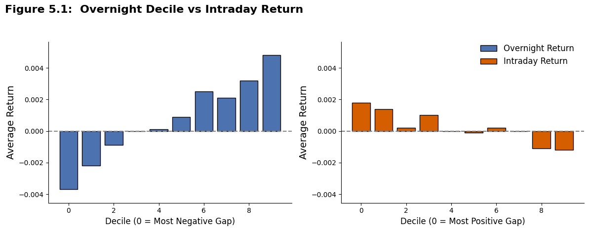
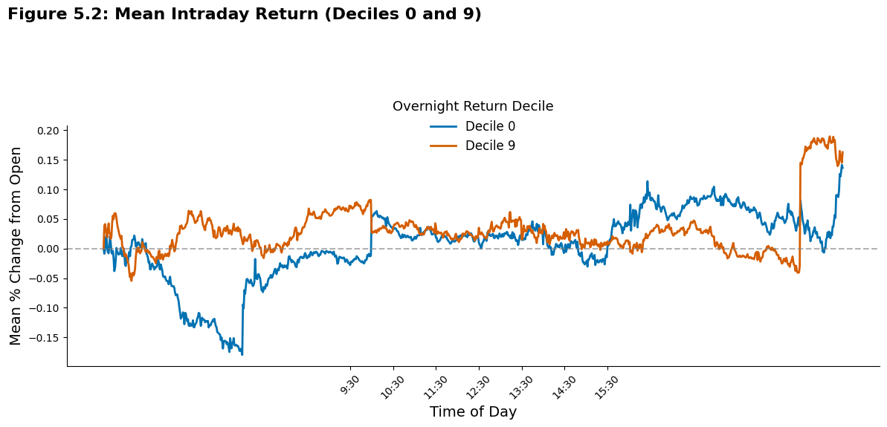
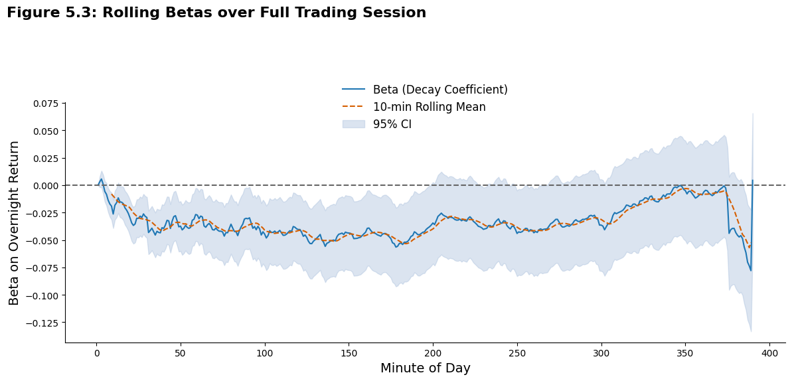
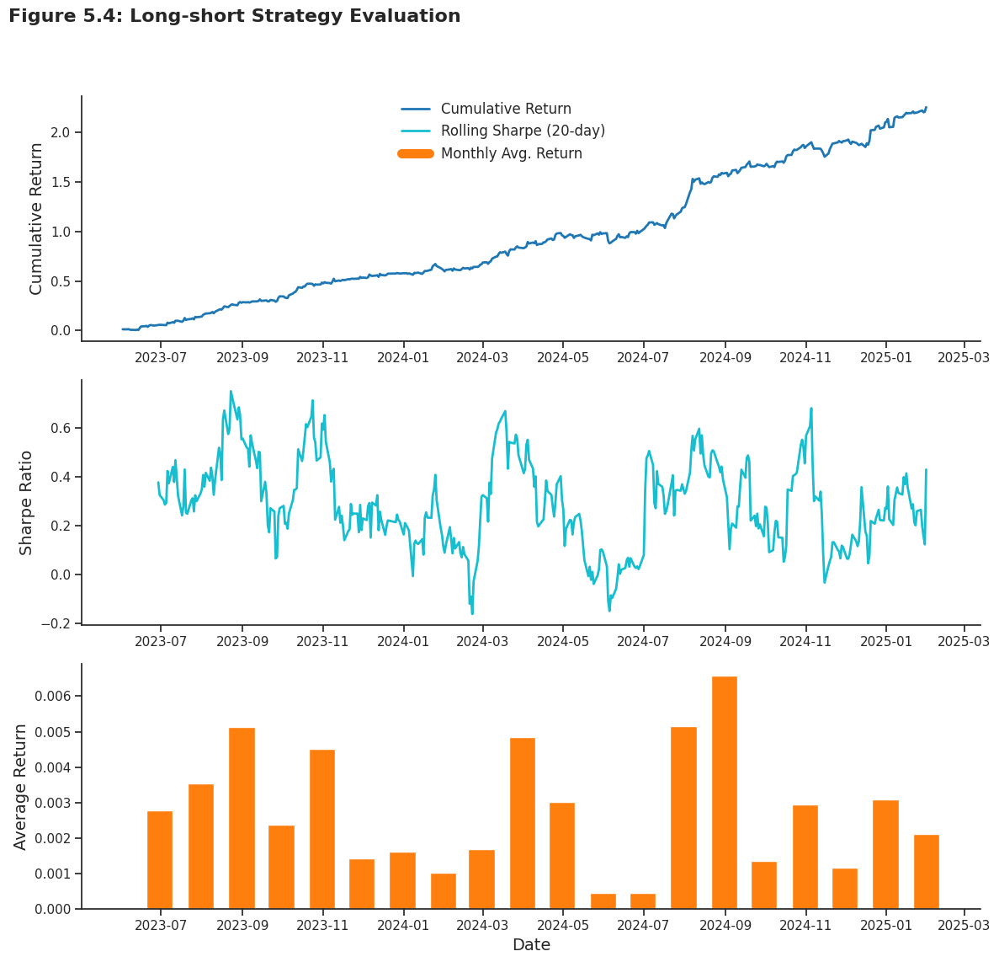

# Intraday Mean Reversion Following Overnight Gaps
## A Decile-Based Analysis Using High-Frequency Data

This project explores the existence and persistence of **intraday return reversals** following **overnight gaps** using high-frequency data from global indices. By forming decile portfolios based on overnight returns, we investigate whether extreme price moves are followed by mean-reverting intraday behavior.


## Overview

- **Institution:** WorldQuant University  
- **Project Type:** MSc Financial Engineering Capstone  
- **Candidate:** Abiemwense Maureen Oshobugie  
- **Supervisor:** Professor Ritabrata Bhattacharyya  
- **Submission Date:** July 22, 2025  


## Research Summary

> “Markets tend to correct overnight overreactions during the day.”

Our empirical study finds that:
- **Extreme overnight winners** underperform during the day.
- **Overnight losers** rebound, creating profitable long-short spreads.
- This reversal effect is strongest **midday** and in **European markets**.
- The signal decays gradually but remains statistically robust over intraday intervals.

**Top-minus-bottom decile spread:**
- **–0.28% daily average return** (t = –5.96)
- **63.11% win rate across days**
- Strongest reversal in first 120 minutes (–0.17%, t = –4.74)


## Key Visualizations

### Figure 5.1 – Average Return by Decile



### Figure 5.2 – Intraday Return Paths for Extreme Deciles



### Figure 5.3 – Rolling Betas on Overnight Return



### Figure 5.4 – Long-short Strategy Evaluation



## Summary Statistics

| Metric                        | Value                  |
|------------------------------|------------------------|
| Long-Short Avg Return        | –0.28% (t = –5.96)     |
| Strongest Region             | Europe (–0.44%)        |
| Strongest Volatility Regime | High (–0.47%)          |
| Signal Persistence (120 min) | –0.17% (t = –4.74)     |
| Positive Days (%)            | 63.11%                 |


### Result Tables
- [Decile-Level Stats (intraday)](results/decile_stats_overview.csv)
- [Decile-Level Stats (overnight)](results/overnight_return_stats.csv)
- [Regional Breakdown](results/regional_results.csv)
- [Volatility Regimes](results/volatility_breakdown.csv)
- [Time-of-Day Segments](results/time_bucket_performance.csv)
- [Fixed Intraday Horizons](results/intraday_horizon_stats.csv)
- [Microstructure Check](results/microstructure_comparison.csv)
- ✔️ [Positive Day Fraction](results/positive_day_fraction.txt)


## Repository Structure

```bash
intraday-mean-reversion/
├── notebooks/
│   ├── Decile_Based_Gap_Analysis.ipynb
│   ├── Preliminary_Analysis_01.ipynb
│   ├── 02_cumulative_returns.ipynb
│   └── Liquididty_Analysis.ipynb
├── figures/
│   ├── fig_5_1_decile_barplot.png
│   ├── fig_5_2_intraday_paths.png
│   ├── fig_5_3_decay_betas.png
|   └── fig_5_4_strategy.png
├── results/
│   ├── decile_stats_overview.csv
│   ├── overnight_return_stats.csv
│   ├── regional_results.csv
│   ├── volatility_breakdown.csv
│   ├── time_bucket_performance.csv
│   ├── intraday_horizon_stats.csv
│   ├── microstructure_comparison.csv
│   └── positive_day_fraction.txt
├── README.md
└── LICENSE
